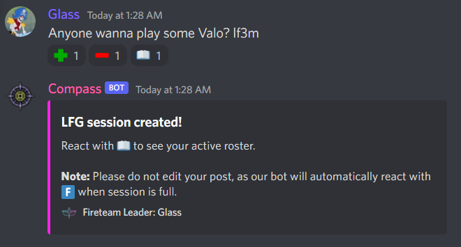

### Destiny Commands

???+ tldr "LFM"
    You can create an LFM post by sending a message to your servers LFG channel (see [Configuration](../Configuration/setup.md) for more info)  
    
    Use "LF`X`M" (case doesn't matter) anywhere in the message, where `X` is the number of players you need.  
    
    The bot will add reactions; users can interact with the post using:  
    
    - Plus (+) to join the activity  
    - Minus (-) to leave the activity  
    - Book (🕮) to see the current activity roster  

    Example:  
    { width="500" }

???+ tldr "Mod commands"
    ```
    ;cm or ;checkmembers [mem/mems/members | vet/vets/veterans | both]
        members:  gets non-veteran members older than 2 months
        veterans: gets veterans not currently in a clan
        both:     gets veteran members of the clan 
    ```