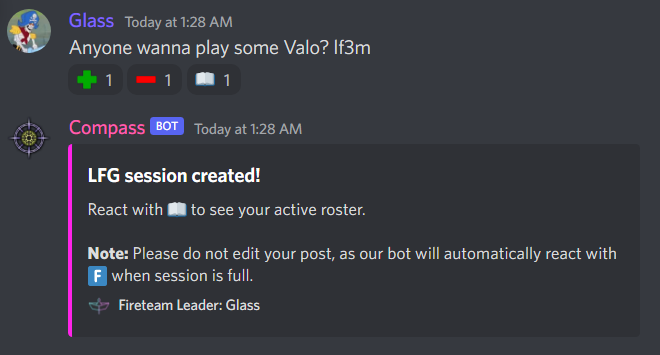

### Gaming Commands

???+ tldr "LFM"
    You can create an LFM (Looking for More) post by sending a message to your servers LFG channel (see [Configuration](../Configuration/setup.md) for more info)  
    
    Use "LF`X`M" (case doesn't matter) anywhere in the message, where `X` is the number of players you need.  
    
    The bot will add reactions; users can interact with the post using:  
    
    - Plus (+) to join the activity  
    - Minus (-) to leave the activity  
    - Book (🕮) to see the current activity roster and standby list

    Once the activity is full, users who try to join will be added to "standby".

    Example:  
    { width="500" }
